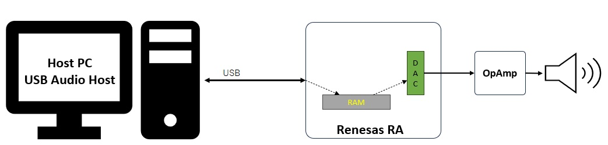

# Introduction #

## Required Resources ##

### Hardware ###
* VUIA6E1POCZ kit
* 1x Micro USB cable
* 1x USB type C cable
* Host PC

### Software ###
* e2 Studio
* Audio Player

# Project Notes #

## System Level Block Diagram ##
 High level block diagram
 

 ## FSP Modules Used ##

 List all the various modules that are used in this example project. Refer to the FSP User Manual for further details on each module listed below.

| Module Name | Usage | Searchable Keyword  |
|-------------|-----------------------------------------------|-----------------------------------------------|
|USBX PAUD| USBX PAUD is used to communicate with the Host machine to perform read audio from the Host and write the same back to the Host. | rm_usbx_port|
| USB Basic Driver | USB driver is required for hardware configuration on RA MCU |r_usb_basic|
|DMAC Transfer |DMAC is used to transfer the USB data to offload MCU usage | r_dmac  |
|DAC Module |DAC is used to convert Audio frame to analog signal | r_dac  |
|General Timer |Timer is used to trigger for DAC module | r_gpt  |

## Module Configuration Notes ##

**USB Configuration Properties**
|   Module Property Path and Identifier   |   Default Value   |   Used Value   |   Reason   |
| :-------------------------------------: | :---------------: | :------------: | :--------: |
| configuration.xml > USB Thread > Properties > Settings > Property > Common > Timer > Timer Ticks Per Second |100 | 1000 |The default ticks should be 1000 indicating 1 tick per millisecond|
| configuration.xml > USB Thread > Properties > Settings > Property > Thread > Priority| 1 | 15 |USB Thread priority is lowered to allow the other USB operations to be serviced at a faster rate|
| configuration.xml > USB Thread Stacks > g_basic0 Instance > Properties > Settings > Property > Common > DMA Support| Disabled | Enabled |DMAC is used to handle the USB data transfer to offload MCU usage|
| configuration.xml > USB Thread Stacks > g_basic0 Instance > Properties > Settings > Property > Common >DMA Source Address| DMA Disabled | FS Address | USB basic driver is configured **USB Speed** as **Full Speed**. Accordingly, DMA Source Address should provide with **FS Address**.|
| configuration.xml > USB Thread Stacks > g_basic0 Instance > Properties > Settings > Property > Common >DMA Destination Address| DMA Disabled | FS Address | USB basic driver is configured **USB speed** as **Full Speed**. Accordingly, DMA Destination Address should provided with **FS Address**.|
| configuration.xml > USB Thread Stacks > g_basic0 Instance > Properties > Settings > Property > Module g_basic0 USB Driver on r_usb_basic > USB Speed| Full Speed | Full Speed | USB Speed is configured as **Hi Speed**. According to the USB Speed, DMA settings should be updated.|
| configuration.xml > USB Thread Stacks > g_basic0 Instance > Properties > Settings > Property > Module g_basic0 USB Driver on r_usb_basic > USB Module Number| USB_IP0 Port | USB_IP0 Port | This property is used to specify USB module number to be used as per configured USB speed.|
| configuration.xml > USB Thread Stacks > g_transfer0 Transfer Driver on r_dmac Instance > Properties > Settings > Property > Module g_transfer0 Transfer driver > Transfer Size| 2 | 2 |The transfer size of DMA for **High Speed** requires **4 Bytes**.|
| configuration.xml > USB Thread Stacks > g_transfer0 Transfer Driver on r_dmac Instance > Properties > Settings > Property > Module g_transfer0 Transfer driver > Activation Source| No ELC Trigger | USBFS FIFO 1 (DMA Transfer request 1)  |This is an event trigger for DMA transfer 0 instance for destination pointer address. |
| configuration.xml > USB Thread Stacks > g_transfer1 Transfer Driver on r_dmac Instance > Properties > Settings > Property > Module g_transfer1 Transfer driver > Transfer Size| 2 | 2 |The transfer size of DMA for **High Speed** requires **4 Bytes**.
| configuration.xml > USB Thread Stacks > g_transfer1 Transfer Driver on r_dmac Instance > Properties > Settings > Property > Module g_transfer1 Transfer driver > Activation Source| No ELC Trigger | USBFS FIFO 0 (DMA Transfer request 0)  |This is an event trigger for DMA transfer 1 instance for source pointer address.|

**DAC Configuration Properties**
|   Module Property Path and Identifier   |   Default Value   |   Used Value   |   Reason   |
| :-------------------------------------: | :---------------: | :------------: | :--------: |
| configuration.xml > USB Thread Stacks > g_dac0 DAC (r_dac) Instance > Properties > Settings > Property > Channel| 0 | 0  |VUIA6E1 used channel 0 for output.|
| configuration.xml > USB Thread Stacks > g_dac0 DAC (r_dac) Instance > Properties > Settings > Property > Data Format| Left Justified | Left Justified  |-|

**General Timer Configuration Properties**
|   Module Property Path and Identifier   |   Default Value   |   Used Value   |   Reason   |
| :-------------------------------------: | :---------------: | :------------: | :--------: |
| configuration.xml > USB Thread Stacks > g_timer_dac Timer (r_gpt) Instance > Properties > Settings > Property > Channel| 0 | 5  |-|
| configuration.xml > USB Thread Stacks > g_dac0 DAC (r_dac) Instance > Properties > Settings > Property > Period| - | 48000  |USB Audio setting 48kHz|
| configuration.xml > USB Thread Stacks > g_dac0 DAC (r_dac) Instance > Properties > Settings > Property > Period Unit| Raw Counts | Hertz  |USB Audio setting 48kHz|

## Verifying operation ##

## Limitations